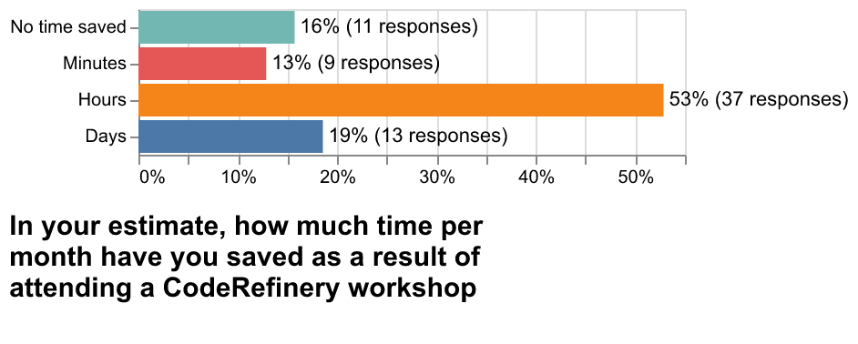
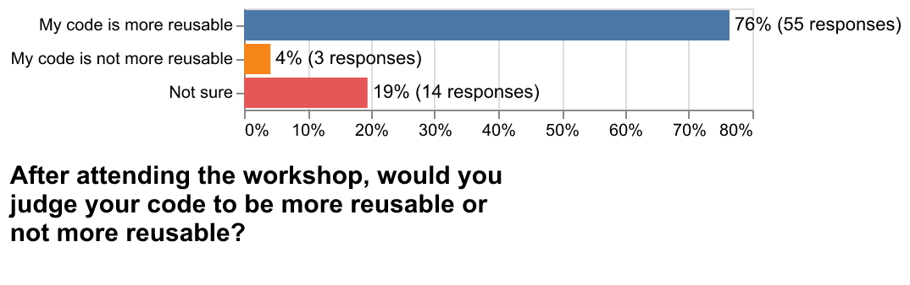
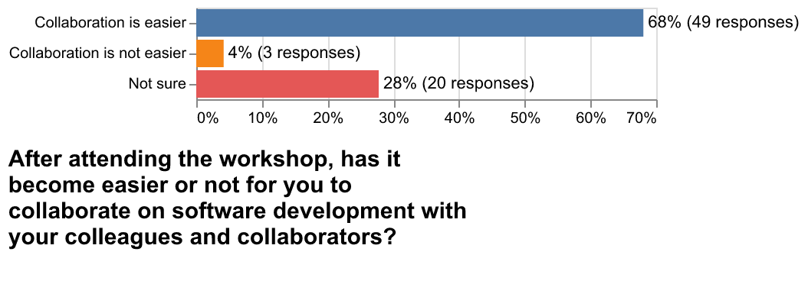
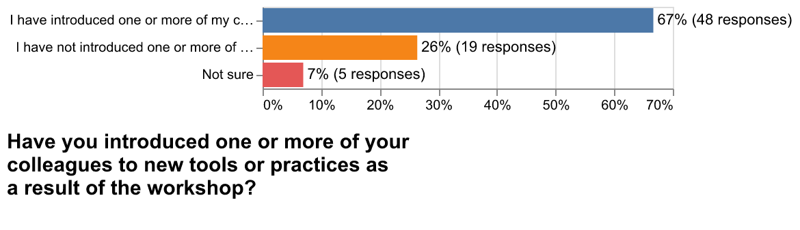
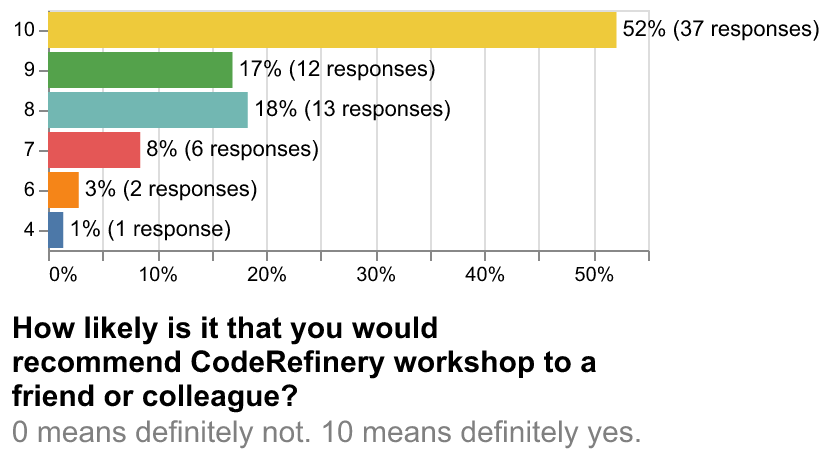
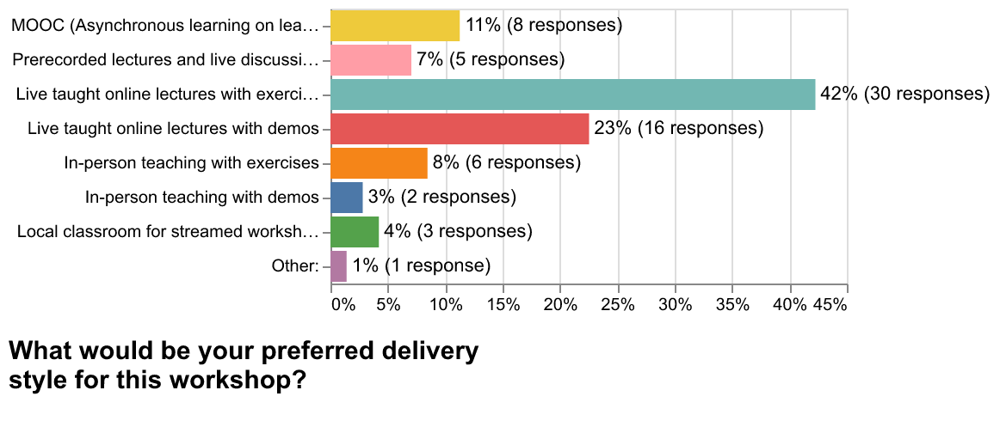
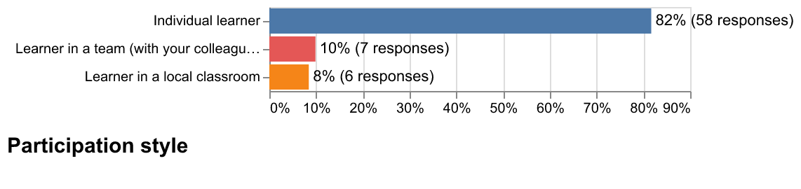
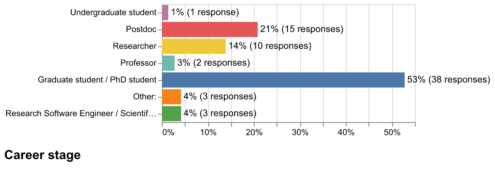
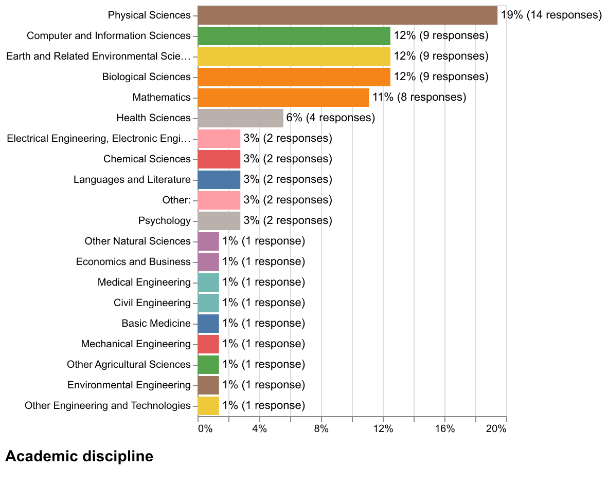

# 2026-post-workshop-survey

This repo includes the results of the post workshop survey sent out to workshop participants from 2024 and 2025.

- Number of delivered submissions: 72
- Survey was open from 2026-04-01 to 2026-04-30
- [Questions](CodeRefinery_post_workshop_survey_questions.pdf)

## Results

### Plots 

### Alt texts

In your estimate, how much time per month have you saved as a result of attending a CodeRefinery workshop
- No time saved: 11
- Minutes: 9
- Hours: 37
- Days: 13

---

After attending the workshop, would you judge your code to be more reusable or not more reusable?
- My code is more reusable: 55
- My code is not more reusable: 3
- Not sure: 14

---

After attending the workshop, has it become easier or not for you to collaborate on software development with your colleagues and collaborators?
- Collaboration is easier: 49
- Collaboration is not easier: 3
- Not sure: 20

---

Have you introduced one or more of your colleagues to new tools or practices as a result of the workshop?
- I have introduced one or more of my colleagues to new tools or practices: 48
- I have not introduced one or more of my colleagues to new tools or practices: 19
- Not sure: 5

---

How likely is it that you would recommend CodeRefinery workshop to a friend or colleague?
- 10: 37
- 9: 12
- 8: 13
- 7: 6
- 6: 2
- 4: 1

---

What would be your preferred delivery style for this workshop?
- MOOC (Asynchronous learning on learning platform): 8
- Prerecorded lectures and live discussion sessions: 5
- Live taught online lectures with exercises: 30
- Live taught online lectures with demos: 16
- In-person teaching with exercises: 6
- In-person teaching with demos: 2
- Local classroom for streamed workshop with exercises: 3

---

Participation style
- Individual learner: 58
- Learner in a team (with your colleagues/friends): 7
- Learner in a local classroom: 6

---

Career stage
- Undergraduate student: 1
- Postdoc: 15
- Researcher: 10
- Professor: 2

---

Academic discipline
- Physical Sciences: 14
- Computer and Information Sciences: 9
- Earth and Related Environmental Sciences: 9
- Biological Sciences: 9
- Mathematics: 8
- Health Sciences: 4
- Electrical Engineering, Electronic Engineering, Information Engineering: 2
- Chemical Sciences: 2
- Languages and Literature: 2
- Other:: 2
- Psychology: 2
- Other Natural Sciences: 1
- Economics and Business: 1
- Medical Engineering: 1
- Civil Engineering: 1
- Basic Medicine: 1
- Mechanical Engineering: 1
- Other Agricultural Sciences: 1
- Environmental Engineering: 1
- Other Engineering and Technologies: 1

---

### Open text questions

- Has anything else changed in how you write code for your research after attending the workshop?

- yes, I revisited my git skills, learned testing functions and Pytest, also learned CI/CD and automated documentation using Sphinx all thanks to Coderefinery!
- I got a lot more relaxed about using GitHub and now I can fix things myself when I screw up
using git more regularly, using command line, improved code layout and documentation
- I'm much more confident using git now. The interactive work on example projects really helped to understand git workflows.
- Most of the question were not relevant for me. I used the workshop as an introduction to git, as I had to teach git later in the year. It was valuable for me to get this introduction as it helped me find my way around git.
- Establishing a standardize style for the project (for example pep 8 in python).
- Whenever I write new code I think about how other people could get more out of it. Version control is also a big aspect. The work with the existing code (that I didn't write) has not changed as much, since it is significantly harder to change
- I participated as a master student in Spring 2024. My coding habits have changed a lot since then due to a variety of factors, and it's hard for me to judge how much is due to the code refinery workshop. But one of the most important changes is using git and version control. And code refinery probably gave me a head start in that.
- more documentation more workflows
- I have started using Git versioning for my codes which has made tracking changes and errors easier. I have also gained knowledge about licenses, modular codes etc
- I am now recommending it to our younger students since it is very important not to give them a chance to stick with bad coding habits. Like using MATLAB. So, it would be great to advertise it more among them, because to my experience most of them have not heard about it before I tell them.
- I’ve learned the importance of prioritizing code maintainability, which is essential for managing complex DH projects effectively.
- I started using GitHub more frequently for the version control, even for personal projects.
- I write more readable codes now. I try to use git now.
- Yes I use git version control now while I didn't at all before
- i understood the general git idea, but still not adopting it in my real work due to its complexity and collaboration with only one or two people
- I still mostly write for myself, but I try to apply as much as possible the advice you gave to make it reusable/"sharable".
- the point of view :)
- Recently, programming has changed a lot. I don't code that much. I use GitHub Copilot a lot. I love the Sphinx documentation, and I use it a lot.
- I did not attend all days.
- I think more about my future self or others that could use what I write in the future.
- no but I became more confident in reviewing someone else's code on github
- Not sure
- I write more tests to ensure that I dont break things later.
- yes
- Added proper version control. Also, results shared (and code used to get them) are always saved and backed up.
- Yes, now I try to be more clear in the coding explanations and names I use in each one of my pipelines.
- I write more modular code with packaging and open sharing it in mind, and create repositories for my projects. I am now trying to implement test-driven coding in my workflow.
- I learned to use git, which make code development so much more structured
- I pay more attention to details and I also plan in advance
- I try to use git more often.
- I'm not actually writing code in collaboration. However, in near future plans are to start writing code, and then I will use my learnings surely and the CodeRefinery has helped.
- no. i forget everything after the workshop.
- My code documentation has gotten much better.
- Mmmm not exactly in writing code itself, but in how I manage it in relation to projects, and awareness of what tools are there for me. I have also used more snakemake flows
- It has become more systematic and organized.
- Now I start every code with reproducibility in mind!
- No - but that is not related to the workshop - but related to colleges not on same level - and not enough time to follow up
knowledge of best practises
- Now I use AI to write some parts of the code or entire tools, if they are small and well defined. So everything is in a state of flux atm.
- I helped me to think more detailed about the way in which currently  test my software, and how can improve the testing phase.
- I always add a licence file when starting a new repo.

What topic(s) are missing from our workshops?

- I can not think but API development maybe!
- working with multiple remotes
- more in-depth intermediate level topics, for example machine learning workflows and using common tools such as wandb, how to do sweeps- This was covered in the HPC kickstart a bit I think, but I would really like to learn this at an intermediate level, i.e. when the models are already set up etc, especially how to manage these incremental improvements when working on a machine learning model.
- I am using uvicorn as a package manager and I believe you might want to recommend this as well for fast and stable virtual environments.
- Contributions to open source software on GitHub. It has been mentioned a bit in the workshop, but could be extended more.
- AI integration for formatting, documentation and structuring the project (maybe now you have included)
- How to make changes to legacy code and how to advocate for the necessity of those changes. Maybe how to handle old dependencies that might need to change.
- It would be nice to tell about how to construct a simple local package. Or a library. And then maybe a guide on how to resolve conflicts in GitHub.
- more tailoring to scientists that use R to analyse their data but do not necessarily write software
- Monitoring cpu usage / gpu usage in cluster, hand-on exercises to making own containers
- None that come to mind, excellent introduction to know where to look for information.
- Programming environment explanation.  ssh-related materials.   I found that even experienced researchers still struggle with these when they are using clusters.
- More about the FAIR principles for research
- LLM supported coding with copilot. I don't know if it is available now.
- Dependency reording with pyproject.toml. It is maybe more complex, but becomes more and more used.
- How to use turtoise git.
- Advanced version of git Code design (advanced version of modular coding)
- None that I can think of.
- Basic steps to get started with running scripts on a server Correct way of putting runs in a GPU server Data wrangling tools 
- I would love to see more about environments and containers. But the length and content of the course was overall great for me.
- How to best work with modern AI tools. (which will be different in half an year again, so good luck with that :D )
- Currently no idea

What topic(s) were least interesting/helpful?

- Everything was interesting and useful
- Some topics were a bit too easy for the course, but I don't think there was anything that was completely not useful.
- Shell crash course, which could be taught in other course.
- I think everything was useful for learning or as a reminder of forgotten tools.
- pandas and such. It was just boring, because in general you will anyway use tools that fit your task
- Git and its use in collaborative coding
- I liked all of them, if not immediately helpful, I believe they can be later.
- Automated testing.  I know this is very important. As a researcher, writing test code is another burden for us besides the working code.
- Jupyter notebooks because I do not really use them for my work
- Snakemake
- Jupyter notebooks
- All were interesting, and the content materials adequate and well prepared.
- deploy in the cloud
- Cannot remember

Anything else you would like to tell us about the workshop format?

- Workshop lectures at first week were a bit intense. Maybe more distributed lectures in couple weeks and give participants the time for hands-on work on their own time.
- I think the format was great! I learned a lot
- It was really well organised.
- Great selection of subjects for broad applicability. I started using many tools recommended during the course which either facilitate my coding or help make my code more accessible for others. Examples include: git, pytest, click, and snakemake.
- I think it is better to have more structured pre-recorded videos, than the live teacher format I saw. It was not always of high quality
- It is great that you post the workshops on Youtube. Thanks!
- Having more tasks on GitHub would help. especially with some personal support session to resolve all questions. For me it is still difficult to maintain GitHub mostly because I have no one to ask for help.
- I think the format is innovative and works well!
- Thank you. I love this workshop. It's practical and useful.
- I find it great as it is. Of course, it would be nice in person but being online, it is more flexible
- I like the format and it was best suiting for me as I could drop-in and out if needed. Recordings are great to have access to. Your documentation pages are fantastic.
- I love the easy pace
- The used format is very good: Live lectures with examples and exercises. Lectures are recorded to be seen if one cannot attend something specific and the lessons are also available all time.
- I was completely new to git so some of the workshop was too overwhelming for my level, and I feel like I have not anchored yet the good practices. I was wondering if it would be interesting near the end of the workshop to have access to a summary of how git works for new people like me.
- I found the workshop really useful. In my opinion it had just the right amount of material and hands on demos to allow me to start learning the subjects in need in my work more deeply myself.
- It's brilliant to offer the videos for future view and learning as I can not attend the long training sessions due to other work. Keep it up - great work!
- in-person workshops would be more effective.
- Intensive workshops of approx. 5h are effective for learning but it is difficult to reserve 5h a day for 3-5 days.  Also towards the end, if the content is new, participants cannot focus and advance as fast.  Maybe considering a 3h daily for a week will make it easier to participate live, otherwise most of it is self-study with the videos.  
- I would just like to thank. The material and format was the best that I got in a course.
- I think the format was excellent already, no need for changes.
- I really like the practical part. But I would like to have more time to solve the exercises.
- I seem to remember I quite enjoyed it.

